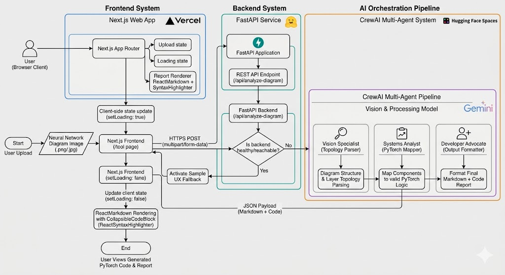

# NeuroDecode 🧠💻

[](https://neurodecode-five.vercel.app/)
[](https://nextjs.org/)
[](https://fastapi.tiangolo.com/)
[](https://github.com/joaomdmoura/crewAI)

NeuroDecode is an AI-powered developer tool that bridges visual system design and executable code.
Upload a neural network architecture image (for example, a CNN block diagram), and NeuroDecode returns:

- a structured Markdown architecture report
- deployable PyTorch starter code

This repository contains the **frontend** application built with Next.js App Router.

---

## What This Project Does

- Accepts user diagram uploads through a polished UI workflow
- Sends image payloads to a FastAPI backend endpoint
- Displays AI-generated architecture reports in rich Markdown
- Renders code blocks with syntax highlighting, copy support, and collapse/expand controls
- Includes a sample flow for demoing the experience even without backend access

---

## Architecture Followed

NeuroDecode follows a **decoupled, service-oriented full-stack architecture**:

- **Frontend (this repo):** Next.js 16 + React 19 + TypeScript + Tailwind CSS v4
- **Backend:** FastAPI service for file upload handling and orchestration entrypoint
- **AI Orchestration:** CrewAI multi-agent pipeline running on Gemini

	- Vision Specialist: parses diagram structure and layer topology
	- Systems Analyst: maps extracted components to valid PyTorch logic
	- Developer Advocate: formats the final Markdown + code report for UI delivery

### Request Flow

```text
User Upload -> Next.js Tool Page -> FastAPI /api/analyze-diagram
					-> CrewAI Multi-Agent Pipeline -> Markdown + PyTorch Output
					-> Frontend Report Renderer + Collapsible Code Blocks
```



### Frontend Architectural Pattern

- App Router pages for route-level separation (`/`, `/tool`, `/about`)
- Reusable UI components (`Navbar`, `InteractivePreview`, `CollapsibleCodeBlock`)
- Client-side state handling for upload, loading, errors, and report rendering
- Environment-based API targeting with `NEXT_PUBLIC_API_URL`

---

## Project Structure

```text
app/
	page.tsx           # Landing page
	tool/page.tsx      # Upload + analyze workflow
	about/page.tsx     # Product and architecture story
	layout.tsx         # Shared layout, navbar, footer
components/
	navbar.tsx
	interactive-preview.tsx
	collapsible-code-block.tsx
public/
```

---

## Small Code Blocks (How Key Parts Work)

### 1) Backend API Targeting (frontend -> FastAPI)

```ts
const API_URL = process.env.NEXT_PUBLIC_API_URL || "http://127.0.0.1:8000";

const response = await fetch(`${API_URL}/api/analyze-diagram`, {
	method: "POST",
	body: formData,
});
```

### 2) Markdown Code Rendering with Custom Collapsible Block

```tsx
<ReactMarkdown
	components={{
		code({ className, children }) {
			return (
				<CollapsibleCodeBlock className={className}>
					{String(children).replace(/\n$/, "")}
				</CollapsibleCodeBlock>
			);
		},
	}}
/>
```

### 3) Sample UX Fallback (no backend required)

```ts
const handleSampleClick = () => {
	setLoading(true);
	setTimeout(() => {
		setReport(sampleMarkdown.trim());
		setLoading(false);
	}, 2500);
};
```

---

## Local Development Setup

### Prerequisites

- Node.js 20+
- npm, pnpm, yarn, or bun

### 1) Install dependencies

```bash
npm install
```

### 2) Configure environment

Create a `.env.local` file in the project root:

```bash
NEXT_PUBLIC_API_URL=http://127.0.0.1:8000
```

Point this to your deployed FastAPI backend URL in production.

### 3) Run the frontend

```bash
npm run dev
```

Open http://localhost:3000

---

## Usage

1. Open the Tool page.
2. Upload a `.png` or `.jpg` architecture diagram.
3. Click **Generate**.
4. Review the architecture report and generated PyTorch code.
5. Copy or expand/collapse code blocks as needed.

If your backend is unavailable, use **Try a Sample CNN Diagram** to preview the full output UI.

---

## Deployment Notes (Full-Stack)

From production hardening, key lessons were:

- avoid low-memory hosting tiers for heavy AI dependencies
- keep SDK dependencies aligned with provider deprecations
- write temp uploads only to writable runtime locations (like `/tmp` in containers)
- use strict model IDs for Gemini configuration
- avoid blocking async server loops with synchronous heavy operations

These lessons informed the current frontend/backend separation and reliability strategy.

---

## Tech Stack

- Next.js 16 (App Router)
- React 19 + TypeScript
- Tailwind CSS v4 + Typography plugin
- React Markdown + React Syntax Highlighter
- Lucide React icons
- Vercel Analytics

---

## Live Demo

- https://neurodecode-five.vercel.app/

---

## Author

Built by Ujjwal Verma.

- GitHub: https://github.com/Ujjwal3115
- LinkedIn: https://www.linkedin.com/in/ujjwalverma3115/

